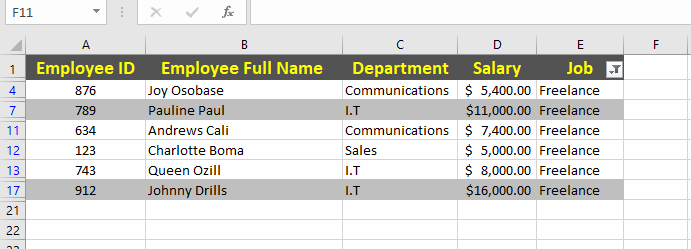
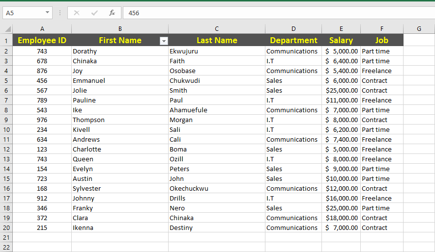
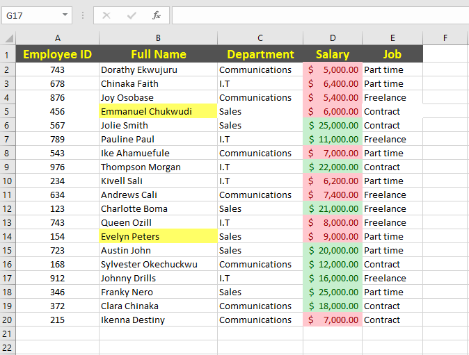

# Data Entry, Filtering, and Formatting

## Introduction:

The Excel task serves as an introductory exercise to get familiarized with basic Excel functions, such as sorting, filtering, and formatting data. This task involve working with a data set comprising employee information, such as; Employee ID, Employee full name, Department, Salary, and Job type.

## Skills Demonstrated:
In the course of completing this task, the following skills and concepts were demonstrated:

## Data entry and manipulation

- Sorting and filtering of data
- Data formatting
- Handling and identifying duplicates in the dataset
  
## Problem Statement:

Data Entry:
1.In worksheet1, create a table with 20 rows of information having the fields below:
- Employee ID
- Employee full name
- Department (Communications, Sales, I.T)
- Salary (between $5000 to $25000)
- Job type (Part time, Freelance, Contract)

2. Copy and paste table into wooksheet 2 and worksheet 3
3. In worksheet 1, show only employees who are 'Freelancers' and highlight the ones whose salaries are above $100000
4. In worksheet 2, split the employees' full names into first name and last name. Check for duplicates and highlight if any (do not delete)
5. In worksheet 3, highlight employees whose names begin with the letter 'E' (in yellow). Format the salary column such that the highest SALARY has a green background and the lowest SALARY has a red background.

A dataset of 20 rows of employee information was created, consisting of the following fields: Employee ID Employee full name Department (Communications, Sales, IT) Salary (ranging from $5000 to $25000) Job type (Part-time, Freelance, Contract)

 Employees who are 'Freelancers' and highlight the ones whose salaries are above $100000:

 
 

The above snapshot shows employees that are'freelancers' and employees with salaries exceeding $10,000 were highlighted for easy identification.

Splitting of Full Names and checking of dupicates if any:

In the snapshot above, the employee's full names were splitted into first names and last names. There was no duplicates found.

 Highlight employees whose names begin with the letter 'E' (in yellow). Format the salary column such that the highest SALARY has a green background and the lowest SALARY has a red background:
 

 

The above snapshot shows employees whose names begins with the letter 'E' and were highlighted in yellow for quick identification. And also, the salary column was formatted in such a way that that the highest salary has a green background while the lowest salary has a red back. 

## Conclusion:

This Excel task demonstrates basic data entry, manipulation and formatting. It showcases the ability to enter, organize and present data effectively within Excel, making it a valuable skill for various business and analytical purposes.
